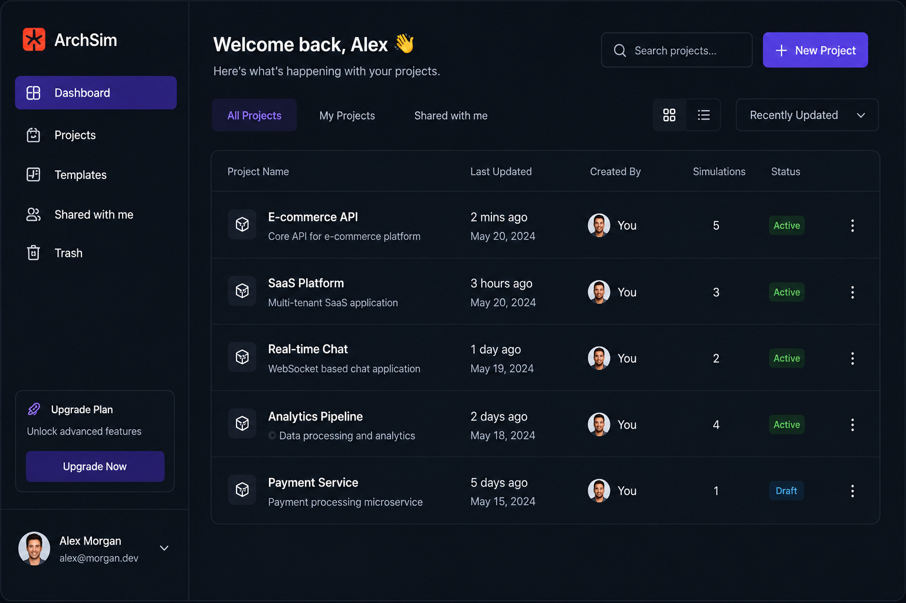
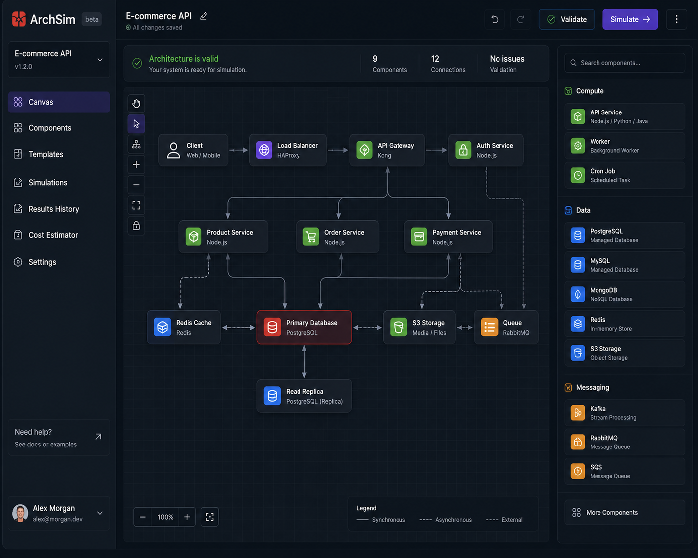
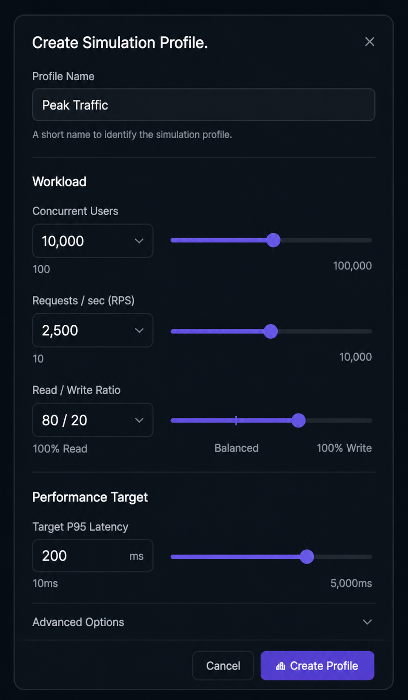
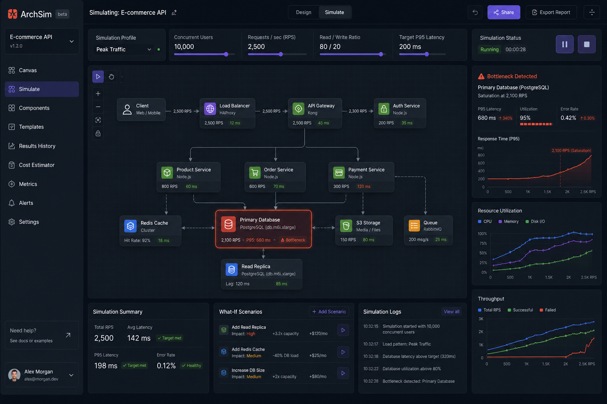
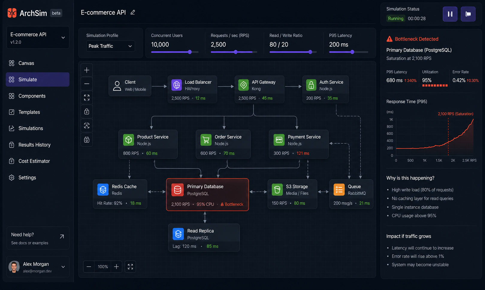
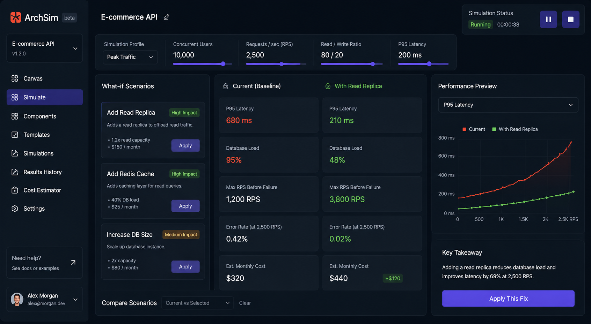
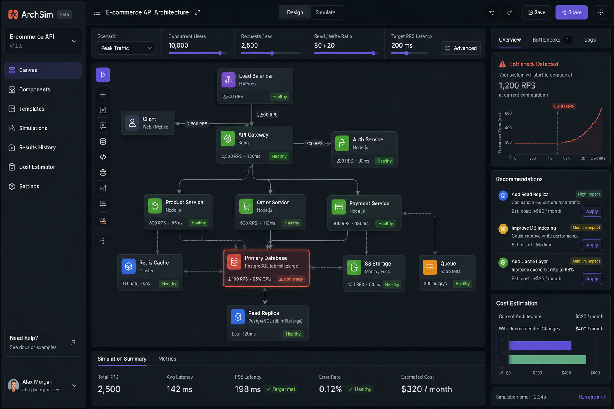

# 🧠 ArchSim - A Pre-Runtime Decision Engine For Software Architecture.

> This product should serve as an architecture reasoning and risk modeling platform that helps developers and software architects evaluate whether a proposed system design is appropriately sized for a given workload before building or deploying it. Instead of pretending to perfectly emulate real infrastructure, the platform should analyze architectural structure, workload characteristics, and infrastructure profiles to identify likely bottlenecks, imbalance, over-engineering, under-provisioning, scaling risks, latency pressure points, and cost inefficiencies. Its purpose is not to provide exact production guarantees, but to give engineers a fast, visual, explainable way to understand which part of their architecture is most likely to fail first, why it happens, and what tradeoffs different fixes introduce.
---

## 🚨 What This Repo Is

This repository explains the **core idea, product thinking, and system behavior** behind an architecture simulation platform.

- ✅ Concept & mental model  
- ✅ How the system works  
- ✅ Simulation logic  
- ✅ Product philosophy  
- ✅ Screenshots / flows  
- ❌ No implementation code  

---

## ❗ The Problem

Designing backend systems today is mostly guesswork.

You either:

- Over-engineer → waste time, money, complexity  
- Under-engineer → system breaks under load  

Most decisions are based on:
- blog posts
- trends
- assumptions  

But the real question is:

> **“Given *my* traffic, what architecture actually works?”**

---

## 💡 The Core Idea

This is not a diagram tool.  
This is not a monitoring tool.

This is:

> **A pre-runtime decision engine for software architecture**

You define:
- system structure  
- expected load  

The system tells you:
- where it breaks  
- why it breaks  
- how to fix it  
- what it costs  

---

## 🧠 Mental Model

> Think: **SimCity for backend systems — but grounded in real constraints**

You’re not drawing boxes.

You’re building a system that **fails under pressure — safely, before production**.

---

## ⚙️ How It Works

### 1. Define Architecture

Model your system as a graph:

**Nodes**
- API
- Services
- Database
- Cache
- Queue

**Edges**
- request flow
- dependencies

> No performance yet — only structure.

---

### 2. Define Workload

This is where realism comes in:

- Concurrent users  
- Requests per second (RPS)  
- Read vs write ratio  
- Target latency (P95)  

> Architecture decisions only make sense *under load*.

---

### 3. Run Simulation

The engine simulates request flow:

1. Requests enter system  
2. Move through nodes  
3. Load accumulates  
4. Latency builds  
5. Capacity limits are tested  

> Goal: not perfect realism — but accurate failure detection

---

### 4. Detect Bottlenecks

Every system breaks somewhere first.

We identify:

- failing node  
- failure threshold  
- latency spike  
- error rate  

And most importantly:

> **Explain WHY it failed**

Example:
- High write load  
- No caching  
- Single database  

---

### 5. What-If Engine

Modify architecture in real-time:

- Add cache  
- Add replicas  
- Scale services  

Instant feedback:

- bottleneck shifts  
- latency improves (or worsens)  
- cost changes  

---

## 🔥 The Real Value

This tool answers:

> **“What breaks first — and what’s the cheapest fix?”**

---

## 🖥️ Product Experience

### Design Mode
- Clean
- Structural
- No metrics

### Simulation Mode
- Reactive
- Load visualization
- System under pressure

### Analysis Mode
- Bottlenecks explained
- Tradeoffs surfaced
- Recommendations provided

---

## 📸 Screenshots

### 🧭 Dashboard

### 🧱 Architecture Canvas

### 📝 Create Simulation Profile

### 📊 Simulation Panel

### ⚠️ Bottleneck Detection

### 🔍 Explore Fixes

### 📈 Simulation Profile Overview

Suggested sections:
- Architecture builder UI  
- Simulation in progress  
- Bottleneck detection panel  
- What-if comparison  

---

## 🎯 Who This Is For

### Indie Hackers
Avoid overbuilding too early

### Startup Engineers
Make smarter scaling decisions

### Developers
Understand system behavior deeply

### Agencies
Explain architecture choices to clients

---

## 🧭 Philosophy

We don’t need tools that say:

> “Use Kafka”

We need tools that say:

> **“You don’t need Kafka — and here’s proof.”**

---

## 🧩 Summary

This project is about shifting architecture from:

> intuition → simulation  
> opinion → data  
